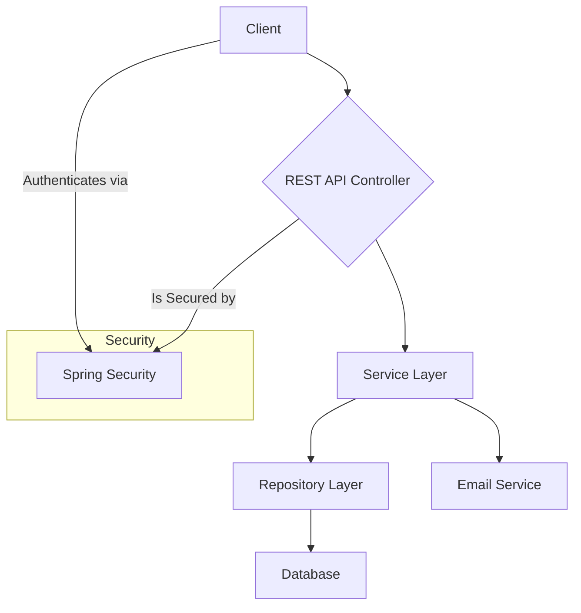
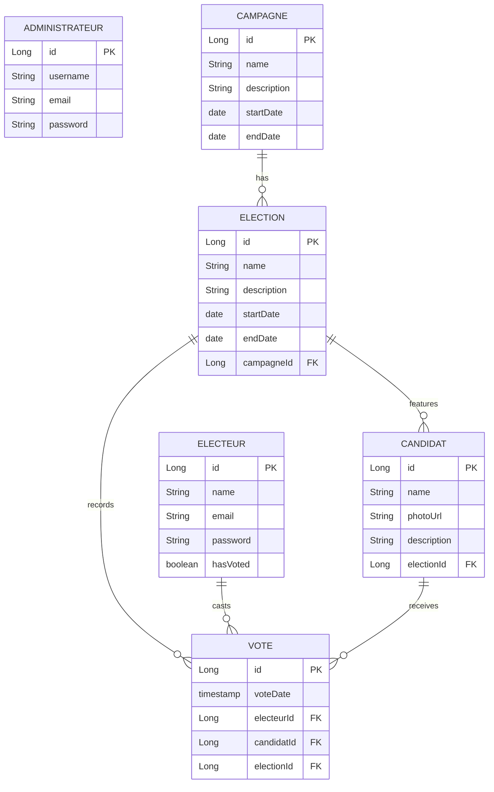

# Electronic Voting Platform

[](https://www.oracle.com/java/technologies/javase/jdk21-archive-downloads.html)
[](https://spring.io/projects/spring-boot)
[](https://github.com/PIO-VIA/Civix)
[](LICENSE)

A secure electronic voting system developed with Spring Boot, providing a comprehensive solution for organizing online elections. The platform ensures the transparency, security, and integrity of the electoral process while maintaining an intuitive user interface.

## ✨ Features

- **Secure Voting**: Unique vote per voter with multiple verifications.
- **Multi-Role Interface**: Separate portals for voters, administrators, and public viewing.
- **Real-Time Results**: Live tracking of results with detailed statistics.
- **Campaign Management**: Complete system for managing candidates and their campaigns.
- **Advanced Reporting**: Generation of detailed reports with CSV export.
- **System Monitoring**: Comprehensive platform monitoring.
- **API Documentation**: Full interactive documentation with Swagger UI.

## 🛠️ Tech Stack

- **Backend**: Spring Boot 3.5.3, Spring Security, Spring Data JPA
- **Database**: PostgreSQL 15+
- **Security**: JWT Authentication, Password hashing with BCrypt
- **API Documentation**: SpringDoc OpenAPI 3 (Swagger UI)
- **Validation**: Jakarta Validation
- **Object Mapping**: MapStruct
- **Email Service**: Spring Mail
- **Build Tool**: Maven

## 🏛️ Architecture

The application follows a classic layered architecture pattern, promoting separation of concerns and maintainability.



### Database Schema

The core of the platform revolves around a few key entities that manage the voting process.



## 🚀 Getting Started

### Prerequisites

- [Java 21+](https://www.oracle.com/java/technologies/javase/jdk21-archive-downloads.html)
- [Maven 3.8+](https://maven.apache.org/download.cgi)
- [PostgreSQL 15+](https://www.postgresql.org/download/)
- [Docker](https://www.docker.com/products/docker-desktop/) (Optional, for containerized setup)

### 1. Clone the Repository

```bash
git clone https://github.com/PIO-VIA/Civix.git
cd electronicvoting
```

### 2. Configure Environment

The application uses an `application.properties` file for configuration. For sensitive data, it's recommended to use environment variables.

Create a `.env` file in the root directory by copying the example:
```bash
cp env.example .env
```

Now, edit the `.env` file with your specific configuration:

```dotenv
# Database Configuration
DB_URL=jdbc:postgresql://localhost:5432/votes
DB_USERNAME=your_db_user
DB_PASSWORD=your_db_password

# Email Configuration (use an app password for Gmail)
EMAIL_USERNAME=your-email@gmail.com
EMAIL_PASSWORD=your-gmail-app-password

# JWT Secret Key
JWT_SECRET=a-strong-and-long-secret-key-for-jwt-token-generation
```

### 3. Run with Maven

1.  **Install Dependencies:**
    ```bash
    ./mvnw clean install
    ```

2.  **Run the Application:**
    ```bash
    ./mvnw spring-boot:run
    ```

The application will be available at `http://localhost:8080`.

### 4. Run with Docker Compose

This is the recommended way to run the application and its database without installing Java or PostgreSQL on your machine.

1.  **Ensure your `.env` file is configured correctly.** The `docker-compose.yml` file uses it.
2.  **Build and Start the Services:**
    ```bash
    docker-compose up --build
    ```

The application will be available at `http://localhost:8080`.

## 📦 API Usage

### API Documentation

The API is fully documented using Swagger UI. Once the application is running, you can access the interactive documentation at:

**[http://localhost:8080/docs](http://localhost:8080/docs)**

### Initial Setup: Create the First Admin

Before using the platform, you must create the first administrator account.

```http
POST /api/setup/first-admin
Content-Type: application/json

{
  "username": "admin",
  "email": "admin@example.com",
  "motDePasse": "AStrongPassword123!",
  "empreinteDigitale": null
}
```

### Authentication

The API uses JWT Bearer tokens for authentication. First, log in using an admin or voter account to receive a token.

-   `POST /api/auth/admin/login`
-   `POST /api/auth/electeur/login`

Include the token in the `Authorization` header for all subsequent requests to protected endpoints.

```
Authorization: Bearer <your_jwt_token>
```

## 🧪 Running Tests

To run the suite of unit and integration tests, use the following Maven command:

```bash
./mvnw test
```

## ☁️ Deployment

The project is configured for deployment using Docker. You can build a Docker image and push it to a container registry.

1.  **Build the JAR file:**
    ```bash
    ./mvnw clean package -DskipTests
    ```

2.  **Build the Docker image:**
    ```bash
    docker build -t your-docker-repo/electronic-voting .
    ```

The `Dockerfile` and `.dockerignore` files are already configured. The project also includes a `.elasticbeanstalk` configuration, suggesting it's ready for deployment on AWS Elastic Beanstalk.

## 🤝 Contributing

Contributions are welcome! Please follow these steps:

1.  Fork the repository.
2.  Create a new branch (`git checkout -b feature/your-feature-name`).
3.  Make your changes and commit them (`git commit -m 'Add some feature'`).
4.  Push to the branch (`git push origin feature/your-feature-name`).
5.  Open a Pull Request.

Please adhere to the existing code style and ensure all tests pass.

## 📜 License

This project is licensed under the MIT License. See the [LICENSE](LICENSE) file for details.